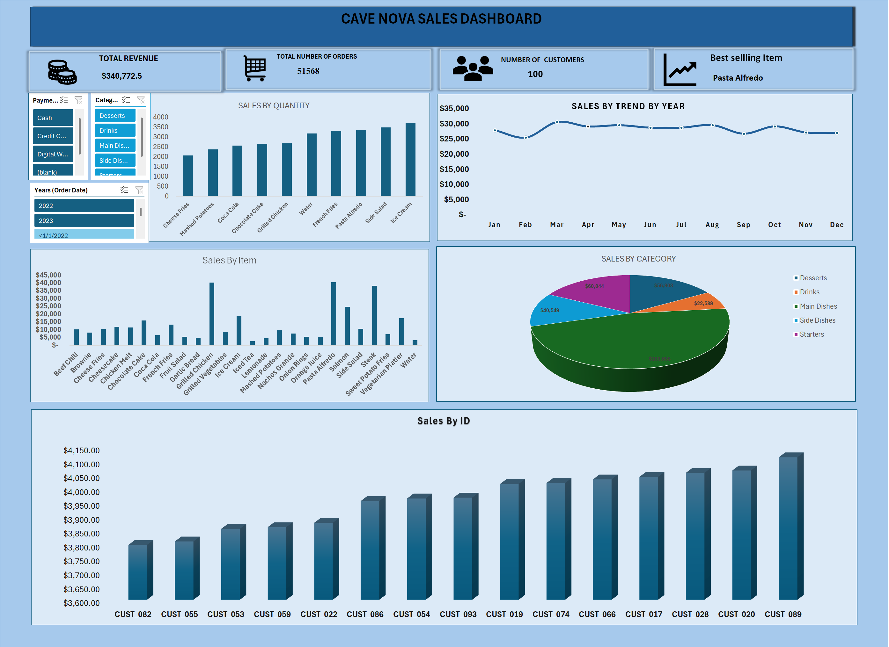

<h1>CAFE NOVA SALES DASHBOARD(EXCEL)</h1>

<h2>Project Overview:</h2>

This project analyzes the Cave Nova sales dataset to evaluate business performance, identify sales trends, and uncover customer behavior insights. 
1. Using Python for data cleaning and flagged outliers
2.  Excel for analysis and dashboarding,
3.  interactive dashboard with slicers
4.  Charts include Bar,Line ,pie
5.  Icon Polish
6.  the project transforms raw data into actionable insights to support data-driven decision-making.

<h2>Cave Nova Dashboard </h2>

  

<h2>FILE</h2>

<a href="github.com/heyzed001/Cafe-Nova-Analysis--3/blob/main/Datasets_%20CafeNova%20Analysis.xlsx" target="_blank">
  Cafe Nova Analysis

  Click on view raw to get the xlsx file
</a>
<h2>How to Use</h2> 

1. Open the Excel File
 

2. Go to the dashboard and ensure a good scale view
 

3. Use the slicer on the dashboard to filter base on information you want to see
 

 <h3>Note</h3>
 
This is not a real data 

